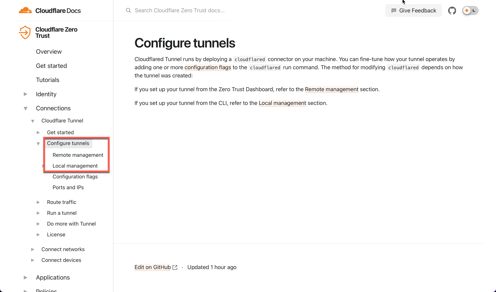

# Cloudflare local vs. remote managed tunnels

## About

Check the following information if you are unsure which tunnel type to use
with this add-on.

## Cloudflare Documentation

Revise the [official Cloudflare documentation][cloudflare-docs]
to see latest information.

## What does this add-on provide

In general you can use both tunnel types (remote or local) with this add-on.

If you like to configure your tunnel from within the add-on configuration page,
the local tunnel is what you are looking for. Take a look at the
[add-on docs](../DOCS.md), to see what options can be used.

If you want to set up and maintain your tunnel from the Cloudflare Zero Trust
Dashboard, you should go for the remote managed tunnel. Have a look at this
[how-to](remote-tunnel.md).

[cloudflare-docs]: https://developers.cloudflare.com/cloudflare-one/connections/connect-apps/configuration/
