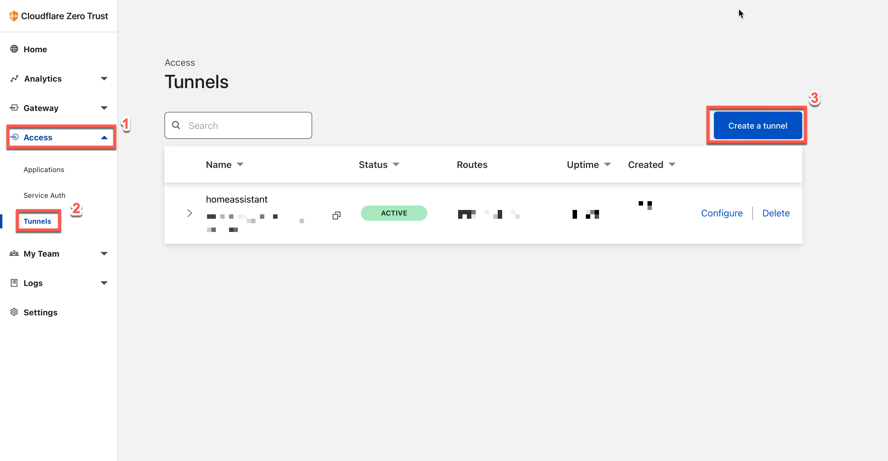
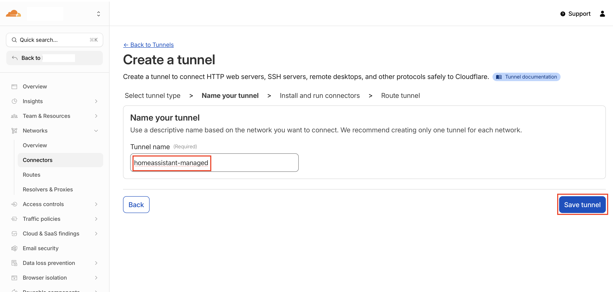
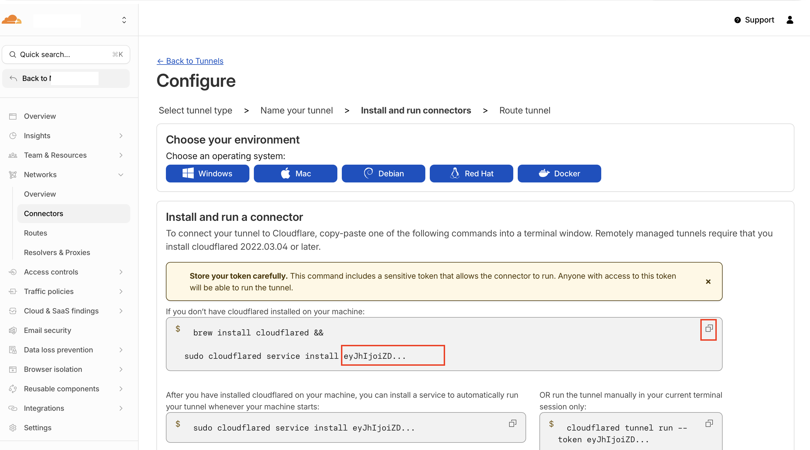
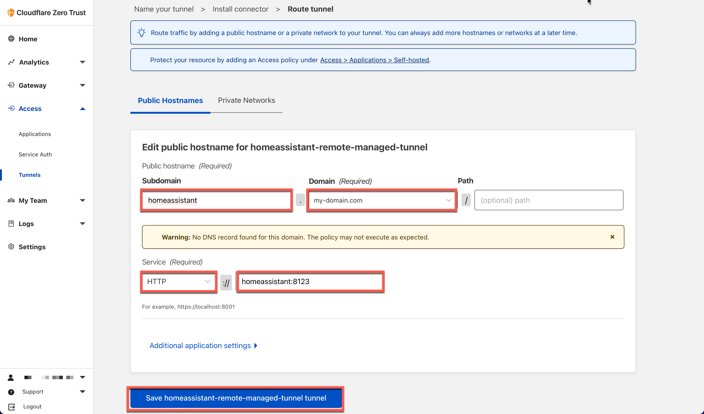
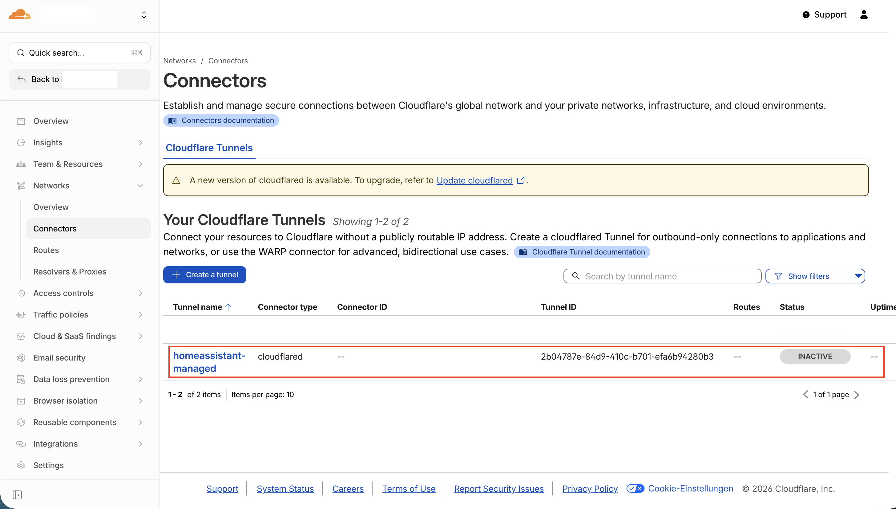
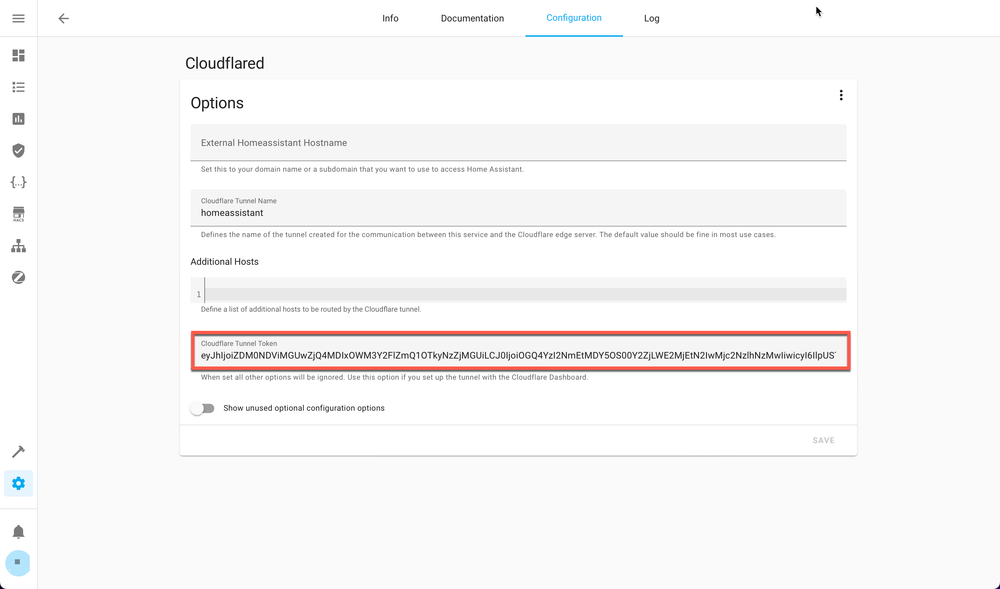
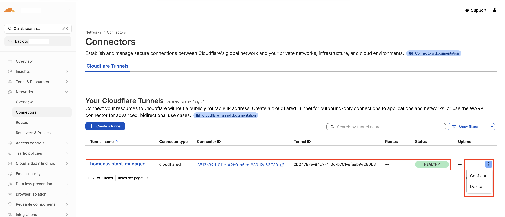

# How to configure remote tunnels to use with Cloudflared Home Assistant add-on

## About

Follow the next steps to create a cloudflare managed tunnel with the
Cloudflare Zero Trust Dashboard and connect the Cloudflared Home Assistant add-on
to use this tunnel.

## Step by step

1. Open [https://dash.teams.cloudflare.com](https://dash.teams.cloudflare.com) and login.
2. Search for the `Tunnels` section in the `Access` menu and create a new tunnel.
   
3. Name the tunnel (choose whatever you like) and hit save.
   
4. The tunnel will be created and a code snippet will be displayed. Extract the
   token out of the code and copy it somewhere safe. (Depending on your OS the picture will vary)
   
5. Add your first `Public Hostname` to proxy through the tunnel.
6. The pictures below shows how to configure Home Assistant with default HA config.
   (HTTP = SSL disabled, default port 8123)
7. The corresponding DNS entry will be automatically added to your Cloudflare DNS
   Zone. If the entry is already exists, you will
   see a corresponding error message.
   
8. The dashboard will show your newly created tunnel.
9. You can `Configure` more hosts (e.g. your NAS, Code Studio add-on, ...)
   or continue with the next step.
   
10. Open your Home Assistant instance and open the Cloudflared add-on configuration
    page. Search for the `tunnel_token` field, named Cloudflare Tunnel Token.
    
11. Copy in your token from step 4 of this guide.
    
12. Start the add-on and check the logs.
13. If everything went well, you should be connected to your tunnel.
    
14. Check the Cloudflare Zero Trust Dashboard again to see that your tunnel is
    connected.
15. You may add additional hosts from there. (Changes will be replicated to your
    tunnel without the need to restart the tunnel/add-on)
    
16. Make sure to adapt your Home Assistant [configuration.yaml](../cloudflared/DOCS.md#configurationyaml) to allow proxying
   traffic from this add-on.
